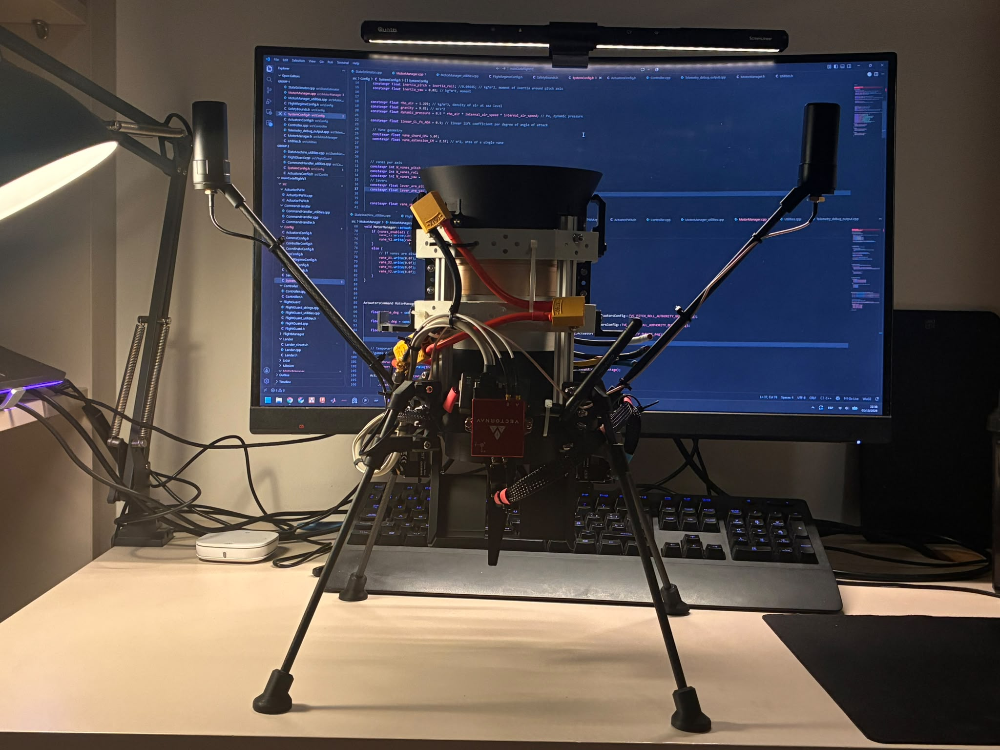
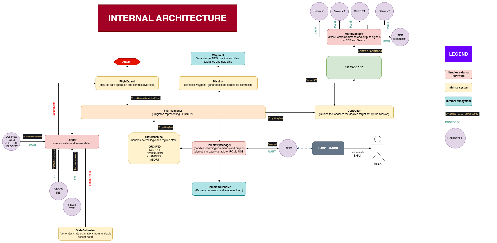
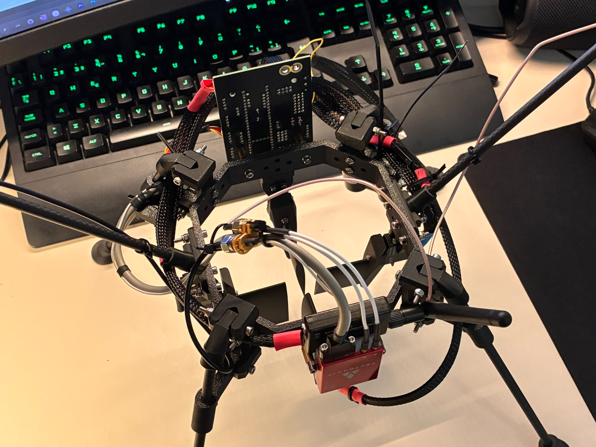

# LEONIDAS LANDER - TRL 4-5
**Autonomous Guidance, Navigation & Control platform for an experimental single-EDF VTOL vehicle.**

Leonidas is an experimental single-EDF VTOL platform developed to design, implement, and flight-test a complete autonomous Guidance, Navigation & Control stack on custom hardware.

The vehicle uses a **90 mm electric ducted fan (EDF)** for propulsion and **four aerodynamic thrust-vectoring vanes** for attitude control. The project covers the complete development chain from mechanical and avionics design to embedded software, state estimation, control, telemetry, simulation, and experimental flight testing.

  

  <i>Updated structure — latest image as of 02/10/2026.</i>

---

## Flight Testing

Leonidas has achieved **stable controlled hover**, validating the core propulsion, thrust-vectoring, sensing, and attitude-control architecture.

The test below was performed indoors without horizontal position feedback. The vehicle therefore stabilizes its attitude and vertical motion while remaining free to drift horizontally.

  

  <i>Indoor flight test without horizontal position feedback — click the image to watch the flight test.</i>

---

## System Architecture

Leonidas uses a cascaded Guidance, Navigation & Control architecture. High-level position commands are progressively converted into velocity, attitude, body-rate, and actuator commands.

  

The control stack is divided into four main loops:

| Control Loop | Frequency | Output |
|---|---:|---|
| Position | 20 Hz | Desired velocity |
| Velocity | 50 Hz | Desired attitude / vertical acceleration |
| Attitude | 100 Hz | Desired body rates |
| Body Rate | 200 Hz | Thrust-vectoring commands |

Running the inner control loops at higher frequencies allows the fast rotational dynamics of the vehicle to be controlled independently from slower navigation and mission-level commands.

---

## Simulation & Controller Development

The flight-control architecture is developed and validated in **MATLAB/Simulink** before being transferred to the embedded flight controller.

Separate simulation models are used to validate the main control cascades, tune controller parameters, analyse transient response, and account for actuator and vehicle limitations before experimental flight testing.

### Altitude Control

The vertical control cascade converts an altitude target into vertical velocity and acceleration demands, ultimately producing the EDF thrust command required to track the desired altitude.

  

  <i>Altitude-control cascade implemented in MATLAB/Simulink.</i>

### Horizontal Position Control

Horizontal motion is controlled through the full position-to-attitude cascade. Position errors generate velocity targets, which are converted into roll and pitch commands before passing through the attitude and body-rate controllers.

  

  <i>Horizontal position-control cascade.</i>

### Yaw Control

Yaw is controlled through a dedicated attitude and body-rate cascade. The yaw target is converted into an angular-rate demand before being translated into thrust-vectoring vane commands.

  

  <i>Yaw target-control cascade.</i>

The simulation environment is also used to evaluate actuator limits, servo resolution, thrust-vectoring effectiveness, disturbance rejection, and controller behaviour before changes are deployed to the vehicle.

---

## Hardware

Leonidas is built around a custom avionics and control architecture integrating the flight computer, inertial navigation, altitude sensing, optical flow, telemetry, propulsion, and thrust-vectoring actuators.

  

  <i>Leonidas avionics and onboard electronics.</i>

### Mechanical Design & CAD

The Leonidas airframe has been **designed entirely from scratch**, with every structural component developed specifically around the requirements of the EDF propulsion system, thrust-vectoring mechanism, avionics, sensors, and landing structure.

The airframe is almost entirely **3D printed using PLA and lightweight PLA Aero**, enabling complex, highly integrated geometries while keeping structural mass to a minimum.

  
  

  <i> CAD assembly and section view showing the internal packaging of the vehicle.</i>

The mechanical architecture has been iteratively optimized around three main requirements:

- **Low mass** — thin-walled components, lightweight PLA Aero parts, and mass-conscious geometry minimize structural weight while maintaining the stiffness required for controlled flight.
- **Modularity** — propulsion, avionics, sensors, landing gear, and thrust-vectoring assemblies are organized as separate modules that can be removed, modified, or upgraded independently.
- **Repairability** — individual structural components can be rapidly reprinted and replaced following damage or design changes without requiring replacement of the complete airframe.

This approach is particularly important for an experimental flight platform undergoing frequent design iterations and flight testing. Components can move rapidly through **CAD, manufacturing, assembly, testing, and redesign** while preserving the overall vehicle architecture.

The resulting structure combines **very low mass with high stiffness, modularity, and repairability**, allowing the airframe to evolve alongside the avionics and flight-control system.

### Flight Computer

The onboard software runs on a **Teensy 4.1**, responsible for:

- Sensor acquisition and processing
- State estimation
- Guidance and control
- Flight-state management
- Safety monitoring
- Actuator commands
- Telemetry

### Propulsion & Thrust Vectoring

Propulsion is provided by a **90 mm 12-blade EDF powered from 6S**, capable of approximately **3.4 kgf maximum thrust**.

A stator downstream of the EDF reduces residual swirl before the airflow reaches the control surfaces.

Four servo-actuated aerodynamic vanes are positioned in the EDF exhaust. By combining their deflections, the vehicle generates control moments around its roll, pitch, and yaw axes.

### VectorNav VN300

A **VectorNav VN300** provides the primary inertial measurements used by the flight controller, including:

- Attitude
- Angular rates
- Linear acceleration
- INS information
- Integrated GNSS data when required

### LiDAR

A downward-facing **Garmin LiDAR-Lite** provides high-rate ground-distance measurements for low-altitude flight.

Measurements are corrected for vehicle attitude and filtered before being used for altitude and vertical-velocity estimation.

### Optical Flow

An **MTF-02P optical-flow sensor** provides ground-relative horizontal motion measurements.

It is used primarily for indoor and GNSS-denied operation, allowing horizontal velocity and position estimation without external positioning infrastructure.

---

## Guidance & Control

Leonidas uses a cascaded control architecture that progressively translates high-level motion objectives into physical actuator commands.

### Position Control

The position controller operates in the **North-East-Down (NED)** reference frame and converts position errors into desired horizontal and vertical velocities.

### Velocity Control

The velocity controller converts horizontal velocity errors into desired roll and pitch commands.

Vertical velocity control determines the acceleration and thrust demand required for climb, descent, and altitude hold.

### Attitude Control

The attitude controller tracks the desired roll, pitch, and yaw and generates corresponding body-rate targets.

### Body-Rate Control

The fastest control loop regulates angular rates and generates the final roll, pitch, and yaw control demands.

### Thrust-Vectoring Mixer

The mixer combines the rotational control demands into commands for the four aerodynamic vanes.

Actuator commands account for mechanical trim, physical limits, and servo resolution.

---

## Flight Management

The controller is integrated into a higher-level flight-management architecture responsible for coordinating the vehicle throughout a mission.

Flight behaviour is divided into operating phases including:

- **READY**
- **TAKEOFF**
- **NAVIGATION**
- **PRE-LANDING**
- **LANDING**
- **COMPLETED**

Each flight regime defines its own motion limits, tolerances, and control constraints.

This allows the same low-level control architecture to operate under different requirements depending on the current phase of flight.

---

## Waypoint & Mission Management

Autonomous navigation is structured around waypoints defined in the local NED reference frame.

Each waypoint can define:

- Target position
- Target heading
- Position and heading tolerances
- Hold duration

Waypoint execution follows an internal state sequence:

**INACTIVE → ACTIVE → REACHED → HOLDING → COMPLETED**

The mission manager coordinates waypoint execution and transitions between navigation, holding, and landing behaviour.

---

## Safety Architecture

Safety monitoring is integrated directly into the flight-control architecture.

The system monitors conditions including:

- Sensor validity and communication
- Vehicle attitude
- Angular rates
- Altitude and operating boundaries
- Actuator availability
- EDF state
- Flight-regime constraints

Sensor drivers use a common fault architecture capable of identifying initialization failures, missing data, timeouts, invalid measurements, excessive measurement changes, communication errors, and sensor-specific faults.

A **FlightGuard** layer can override normal control behaviour when operating constraints are violated.

---

## Telemetry & Ground Station

Leonidas provides real-time telemetry over both USB and radio links.

Telemetry includes:

- Vehicle state
- Sensor measurements
- Controller states
- Actuator commands
- Mission information
- Safety and fault information
- Debug data

  

  <i>Real-time telemetry visualization during development and testing.</i>

The ground station is used during testing to monitor the vehicle and analyse controller behaviour in real time.

---

## Software Architecture

The onboard software is divided into dedicated modules for:

- Sensors and state estimation
- Guidance and control
- Actuator management
- Flight-state management
- Mission management
- Safety monitoring
- Telemetry
- Configuration

Hardware-specific drivers are separated from higher-level flight logic, allowing individual components to be tested and modified without changing the overall control architecture.

---

## Current Status

Leonidas is under active development.

### Implemented & Tested

- Stable controlled hover
- LiDAR-based altitude estimation
- Vertical velocity estimation
- Cascaded flight-control architecture
- Attitude and body-rate control
- Thrust-vectoring actuator mixing
- Flight-state management
- Mission and waypoint architecture
- Safety and sensor-fault monitoring
- Real-time telemetry
- MATLAB/Simulink controller simulation

### Current Development

- Optical-flow integration
- Horizontal velocity and position hold
- Yaw-control refinement
- Autonomous waypoint execution
- Autonomous take-off and landing validation
- Expanded flight testing

---

## Project Scope

Leonidas is primarily a **research and engineering platform** for developing and experimentally validating autonomous flight-control architectures on an unconventional VTOL vehicle.

The objective is not simply to build a flying platform, but to develop the complete chain from **sensing and estimation to guidance, control, actuation, safety, mission management, and experimental validation**.

---

## Contact

**Alex Carrera**  
Sorbonne Université  
Aerospace / Robotics Engineering

alexcarrerav2@gmail.com